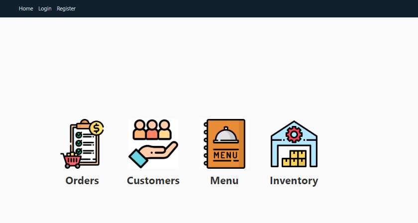
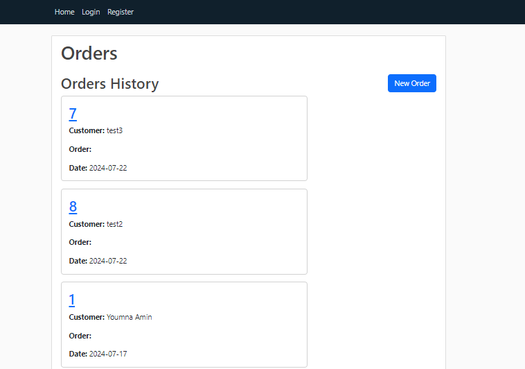

# Custom ERP System for Small Businesses

## Introduction
Welcome to the Custom ERP System designed specifically for small businesses, startups, and home businesses. This ERP system aims to streamline operations with four main modules: Orders, Menu, Inventory, and Customer Management. Built with Flask, Python, and SQLite, it provides a user-friendly interface to manage essential business processes efficiently.

### Live Demo
Check out the live demo of our ERP system [here](#).

### Blog Article
Read the full project blog article [here](#).

### Author
Connect with the author on LinkedIn: [https://www.linkedin.com/in/youmna-amin-34a8ba21b/](#).

## Installation
To get a local copy up and running, follow these steps:

1. **Clone the repository:**
    ```bash
    git clone https://github.com/YoumnaAmin/Custom_ERP.git
    ```
2. **Navigate to the project directory:**
    ```bash
    cd Custom_ERP
    ```
3. **Create a virtual environment:**
    ```bash
    python -m venv venv
    ```
4. **Activate the virtual environment:**
    - On Windows:
        ```bash
        venv\Scripts\activate
        ```
    - On macOS/Linux:
        ```bash
        source venv/bin/activate
        ```
5. **Install the dependencies:**
    ```bash
    pip install -r requirements.txt
    ```
6. **Set up the database:**
    ```bash
    flask db init
    flask db migrate
    flask db upgrade
    ```
7. **Run the application:**
    ```bash
    flask run
    ```

## Usage
Upon running the application, you will have access to the following modules:

1. **Orders Module:**
   - Display order history
   - Create new orders
   - Edit or delete orders

2. **Customer Module:**
   - Save customer information automatically based on orders
   - View customer details

3. **Menu Module:**
   - Manage products and prices
   - Add or delete products

4. **Inventory Module:**
   - Track ingoing and outgoing products
   - Manage inventory levels

### Screenshots




## Contributing
Contributions are welcome! Please follow these steps to contribute:

1. **Fork the repository:**
2. **Create a new branch:**
    ```bash
    git checkout -b feature-branch
    ```
3. **Make your changes:**
4. **Commit your changes:**
    ```bash
    git commit -m "Add some feature"
    ```
5. **Push to the branch:**
    ```bash
    git push origin feature-branch
    ```
6. **Create a pull request:**

## Related Projects
Here are some related projects you might find interesting:

- [ERPNext](https://github.com/frappe/erpnext)
- [Odoo](https://github.com/odoo/odoo)

## Licensings
This project is licensed under the MIT License - see the [LICENSE](LICENSE) file for details.
